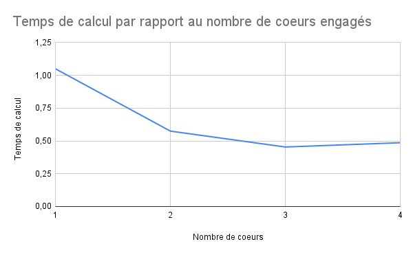
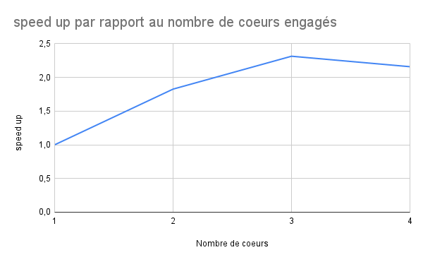

# Compte rendu TP OS202

## Introduction 

Ma machine est composée de 4 coeurs physiques et de 4 coeurs logiques. Elle n'est pas multithreadée. Il faut également noter que c'est une machine virtuelle. 100% des capacités de la machine réelle lui sont allouées (4 coeurs physiques)

Le cache L1 est de taille : 320 KiB
Le cache L2 est de taille : 2 MiB


```
Architecture :                          x86_64
Mode(s) opératoire(s) des processeurs : 32-bit, 64-bit
Boutisme :                              Little Endian
Address sizes:                          39 bits physical, 48 bits virtual
Processeur(s) :                         4
Liste de processeur(s) en ligne :       0-3
Thread(s) par cœur :                    1
Cœur(s) par socket :                    4
Socket(s) :                             1
Nœud(s) NUMA :                          1
Identifiant constructeur :              GenuineIntel
Famille de processeur :                 6
Modèle :                                126
Nom de modèle :                         Intel(R) Core(TM) i5-1035G1 CPU @ 1.00GH
                                        z
Révision :                              5
Vitesse du processeur en MHz :          1190.400
BogoMIPS :                              2380.80
Constructeur d'hyperviseur :            KVM
Type de virtualisation :                complet
Cache L1d :                             192 KiB
Cache L1i :                             128 KiB
Cache L2 :                              2 MiB
Cache L3 :                              24 MiB
Nœud NUMA 0 de processeur(s) :          0-3
Vulnerability Itlb multihit:            KVM: Mitigation: VMX unsupported
Vulnerability L1tf:                     Not affected
Vulnerability Mds:                      Not affected
Vulnerability Meltdown:                 Not affected
Vulnerability Mmio stale data:          Vulnerable: Clear CPU buffers attempted,
                                         no microcode; SMT Host state unknown
Vulnerability Retbleed:                 Vulnerable
Vulnerability Spec store bypass:        Vulnerable
Vulnerability Spectre v1:               Mitigation; usercopy/swapgs barriers and
                                         __user pointer sanitization
Vulnerability Spectre v2:               Mitigation; Retpolines, STIBP disabled, 
                                        RSB filling, PBRSB-eIBRS Not affected
Vulnerability Srbds:                    Unknown: Dependent on hypervisor status
Vulnerability Tsx async abort:          Not affected

```

## Automate cellulaire 1D

1 - Les diagrammes correspondants aux différentes configurations sont générés de façon indépendants. On peut alors commencer avec une première parallélisation qui consiste à distribuer à chaque coeur un nombre de configurations à étudier.

Une utilise ici une parallélisation statique.

```mpirun -np 4 python3 auto_par.py```

Une façon d'estimer le temps d'exécution de ce programme est de prendre le temps maximum d'exécution parmi les n processus engagés (ici 4)




Une seconde parallélisation possible aurait été de séparer chaque diagramme en autant de sous diagramme qu'il y a de processus disponibles. Les sous diagrammes seraient ensuite réassemblés pour ne former qu'un. Il aurait alors fallu prendre en compte l'ajout des ghost cells. Il n'est pas sûr que le résultat soit meilleur car chaque processus doit s'occuper de chaque diagramme.

## Calcul d'une enveloppe convexe

1 - On exécute avec la commande suivante : ```mpirun -np 2 python3 enveloppe_convexe_par.py```

Lors de cette première parallélisation à 2 coeurs, pour chaque processus, on obtient un temps moyen de calcul de l'enveloppe convexe de 0.260 s

Pour le cas séquentiel, on a un temps de calcul de cette enveloppe de 0.613 s

On obtient alors un **speed up = 2,35**

2 - Pour 4 coeurs, on obtient un temps moyen de calcul de l'enveloppe convexe de 0.409 s

On obtient alors un **speed up = 1,50**

Une erreur est dûe au fait que le dernier processus peut avoir plus de points à gérer dans nuage. Ceci à cause de la possible non divisibilité du nombre initial de point par le nombre de threads.