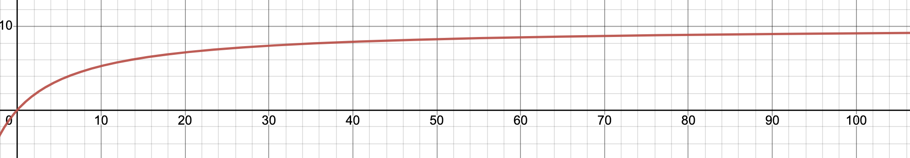

# TP2 de MOREL et MSSELLATI

`pandoc -s --toc tp2.md --css=./github-pandoc.css -o tp2.html`

## Exercice 2.1
(Référence à la slides 28 du cours 1)
1/ Imaginons un premier scenario. Le process de rang 0 envoi à 2, celui de rang 1 n'as pas encore eu le temps d'envoyer, donc celui de rang 2 reçoit bien clé message de 1. Ensuite 2 envois à 0 et attends le message de 2, qu'il reçoit. 

2/ Dans un second scénario où l'on pourrait avoir interblocage dans le cas ou les tags ne correspondrait pas. En effet, dans le cas ou le tag du send de rang 1 correspondrais au tag du premier receive de rang 2. Et que le tag de receive de rang 0 et send de rang 2 ne correspondent pas, on se retrouve dans une situation ou 0 attends le message de 2 et 2 attends le message de 1, on est de ce fait face à un interblocage à plus de 2 processus. 

Nous pensons que probabilité pour que ce genre d'erreurs de code arrivent relativement souvent.

## Exercice 2.1
 En utilisant la loi d'Amdahl pour n>>1, on a que le speed up peut être au maximum égale à 1/(10%) = 10

On peut voir que l'asymptote est lente, ce qui est normal puisque selon l'énoncé il y a une forte capacité de parallélisation. 
Nous pensons que 32 cœurs serait un bon compromis (ce qui reste beaucoup), en effet à 32 cœurs, on est à presque 9 de speed up. Nous pensons que l'important est dépassé le cap des 14-15 cœurs, à ce stade, nous sommes déjà à 8 de speed up.

## Mandelbrot 

*Expliquer votre stratégie pour faire une partition équitable des lignes de l'image entre chaque processus*

           | Taille image : 800 x 600 | 
-----------+---------------------------
séquentiel |              
1          |              
2          |              
3          |              
4          |              
8          |              

*Discuter sur ce qu'on observe, la logique qui s'y cache.*

*Expliquer votre stratégie pour faire une partition dynamique des lignes de l'image entre chaque processus*

           | Taille image : 800 x 600 | 
-----------+---------------------------
séquentiel |              
1          |              
2          |              
3          |              
4          |              
8          |              

## Produit matrice-vecteur

*Expliquer la façon dont vous avez calculé la dimension locale sur chaque processus, en particulier quand le nombre de processus ne divise pas la dimension de la matrice.*
