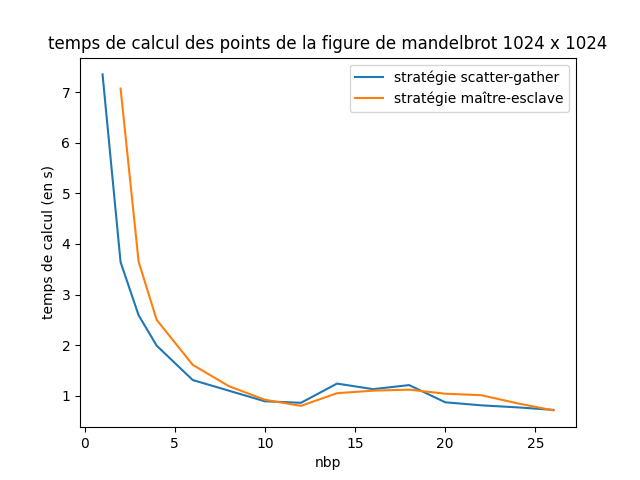

# TP2 de MSSELLATI Noam et MOREL Florian


## lscpu (machine de l'ENSTA)

```
Architecture :                          x86_64
Mode(s) opératoire(s) des processeurs : 32-bit, 64-bit
Boutisme :                              Little Endian
Processeur(s) :                         32
Liste de processeur(s) en ligne :       0-31
Thread(s) par cœur :                    2
Cœur(s) par socket :                    8
Socket(s) :                             2
Nœud(s) NUMA :                          2
Identifiant constructeur :              GenuineIntel
Famille de processeur :                 6
Modèle :                                62
Nom de modèle :                         Intel(R) Xeon(R) CPU E5-2640 v2 @ 2.00GHz
Révision :                              4
Vitesse du processeur en MHz :          2294.345
Vitesse maximale du processeur en MHz : 2500,0000
Vitesse minimale du processeur en MHz : 1200,0000
BogoMIPS :                              3990.13
Virtualisation :                        VT-x
Cache L1d :                             32K
Cache L1i :                             32K
Cache L2 :                              256K
Cache L3 :                              20480K
Nœud NUMA 0 de processeur(s) :          0-7,16-23
Nœud NUMA 1 de processeur(s) :          8-15,24-31
Drapaux :                               fpu vme de pse tsc msr pae mce cx8 apic sep mtrr pge mca cmov pat pse36 clflush dts acpi mmx fxsr sse sse2 ss ht tm pbe syscall nx pdpe1gb rdtscp lm constant_tsc arch_perfmon pebs bts rep_good nopl xtopology nonstop_tsc cpuid aperfmperf pni pclmulqdq dtes64 monitor ds_cpl vmx smx est tm2 ssse3 cx16 xtpr pdcm pcid dca sse4_1 sse4_2 x2apic popcnt tsc_deadline_timer aes xsave avx f16c rdrand lahf_lm cpuid_fault epb pti intel_ppin ssbd ibrs ibpb stibp tpr_shadow vnmi flexpriority ept vpid fsgsbase smep erms xsaveopt dtherm ida arat pln pts md_clear flush_l1d

```


# 2.1 Question de cours

(référence à la slides 28 du cours 1)

### Q1. 
Imaginons un premier scenario. Le process de rang 0 envoie à 2, celui de rang 1 n'a pas encore eu le temps d'envoyer, donc celui de rang 2 reçoit bien le message de 1. Ensuite 2 envoie à 0 et attend le message de 2, qu'il reçoit. 

### Q2.  
Dans un second scenario où l'on pourrait avoir interblocage dans le cas où les tags ne corresponderaientt pas. En effet dans le cas où le tag du send de rang 1 correponderait au tag du premier receive de rang 2, et que le tag du receive de rang 0 et send de rang 2 ne correspondent pas, on se retrouve dans une situation où 0 attend le message de 2 et 2 attend le message de 1, on est donc face à un interblocage à plus de 2 processus. 

# 2.3 Ensemble de mandelbrot


## **Répartition égale entre les processus**

`mpirun -np 4 python3 python/mandelbrot.py`


  ordre  | 256 x 256    | 512 x 512| 1024 x 1024 | speedup (par rapport à nbp = 1, sur du 1024x1024)
---------|--------------|----------|-------------|----------------
nbp = 1  |   0.45 s     |   1.81 s |  7.35 s     |  -
nbp = 2  |  0.22 s      |   0.94 s |  3.64 s     |  200 %
nbp = 3  |   0.16 s     |   0.64 s |  2.59 s     |  284 %
npb = 4  |  0.12 s      |   0.51 s |  1.99 s     |  369 %
nbp = 6  |    0.08 s    |   0.32 s |  1.31 s     |  561 %
nbp = 8  | 0.07 s       |   0.27 s |  1.10 s     |  668 %
nbp = 10 |      0.06 s  |   0.23 s |  0.89 s     |  826 %
nbp = 12 |      0.08 s  |   0.34 s |  0.86 s     |  855 %
nbp = 14 |  0.18 s      |   0.33 s |  1.24 s     |  593 %
nbp = 16 |      0.06 s  |   0.31 s |  1.13 s     |  650 %
nbp = 18 |  0.08 s      |   0.46 s |  1.21 s     |  607 %
nbp = 20 |      0.07 s  |   0.22 s |  0.87 s     |  845 %
nbp = 22 |    0.06 s    |   0.24 s |  0.81 s     |  907 %
nbp = 24 |    0.05 s    |   0.24 s |  0.77 s     |  955 %
nbp = 26 |    0.07 s    |   0.03 s |  0.72 s     |  1021 %

Assez naturellement, on remarque une nette augmentation de la vitesse de calcul lorsque le nombre de processus (inférieur au nombre de processeurs) augmente. Cependant, On remarque une rupture lorsque *nbp = 14*. On peut supposer que le travail n'est pas suffisamment parallélisable. Chaque processus va réaliser sa tache rapidement mais va perdre du temps en recevant et en renvoyant la tâche au processus 0. 

Pour expliquer la discontinuité en nbp = 14, on peut supposer qu'il y a 12 processeurs plus performants que les autres. Lorsque nbp < 12, ces 12 processeurs performants vont automatiquement être sélectionnés pour réaliser le calcul. Lorsque nbp > 12, des processeurs moins puissants vont obigatoirement devoir réaliser des tâches. Ils vont alors faire ralentir l'exécution de la tâche globale. Lorsque nbp = 26, le temps d'exécution est redescendu. Malgré les processeurs lents, chaque processeur a moins de travail, cela diminue donc le temps d'exécution de la tâche globale.

## **Stratégie maître-esclave**

`mpirun -np 4 python3 python/mandelbrotMasterSlave.py`

ordre  | 1024 x 1024    | speedup
---------|--------------|----------------
nbp = 2  |  7.07 s      |  -
nbp = 3  |   3.65 s     |  194 %
npb = 4  |  2.50 s      |  283 %
nbp = 6  |    1.61 s    |  439 %
nbp = 8  |  1.19 s      |  594 %
nbp = 10 |     0.92 s   |  768 %
nbp = 12 |      0.80 s  |  884 %
nbp = 14 |  1.05 s      |  673 %
nbp = 16 |     1.10  s  |  661 %
nbp = 18 |  1.12 s      |  631 %
nbp = 20 |      1.04 s  |  680 %
nbp = 22 |    1.01 s    |  700 %
nbp = 24 |    0.85 s    |  832 %
nbp = 26 |    0.71 s    |  996 %

On remarque que les temps d'exécution sont inférieurs à ceux de la stratégie précédente. Ceci s'explique simplement par le fait que pour un même nbp, la stratégie maitre-esclave a 1 processeur en moins qui effectue les calculs (le maître). Cette perte de temps aurait pu être compensée en distribuant des tâches aux différents processeurs en fonction de leur puissance. Un processeur puissant aura plus de tâches à effectuer et vice-versa.


